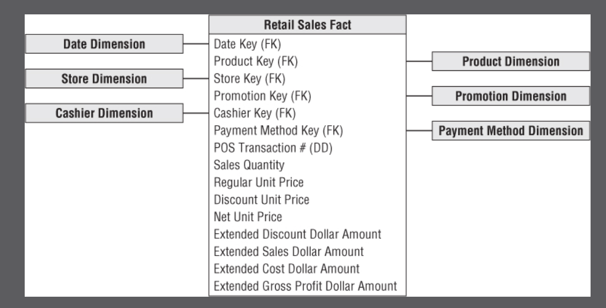
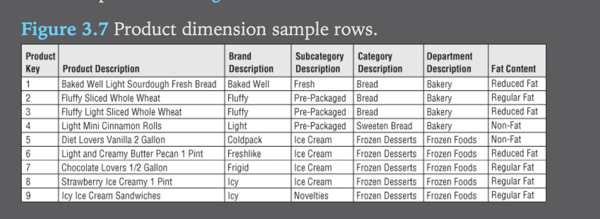
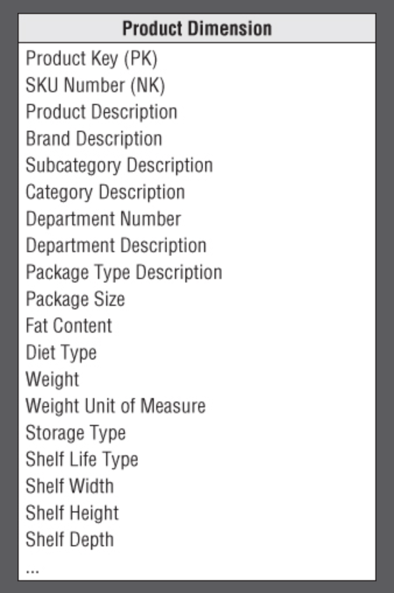
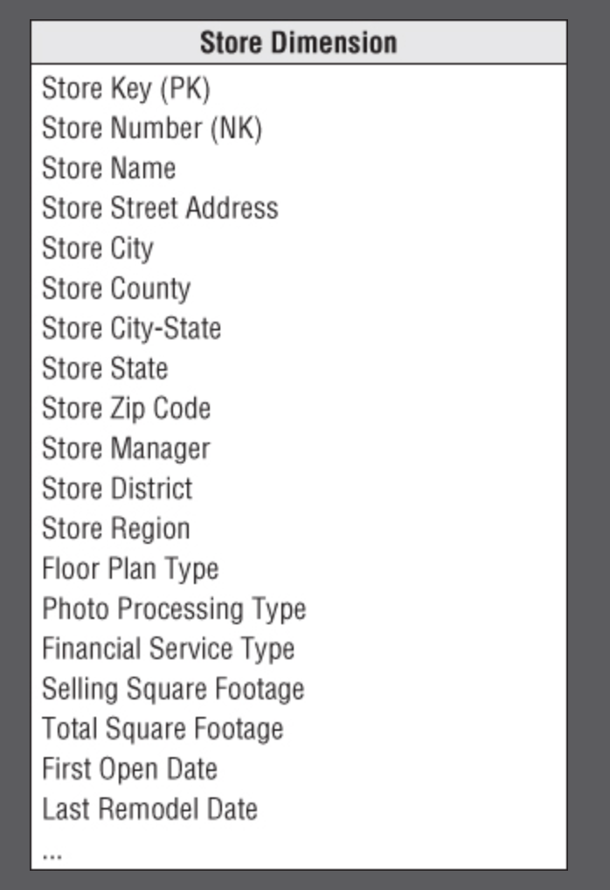
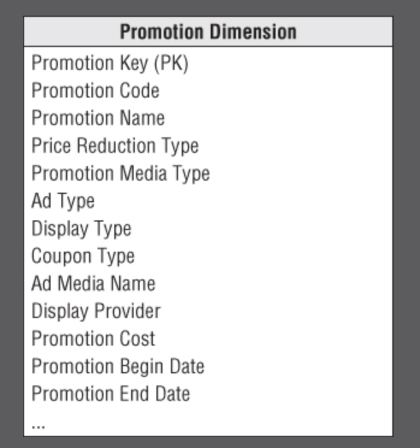
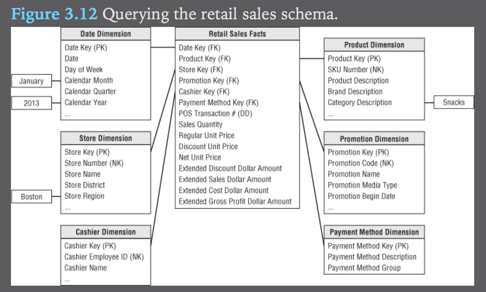
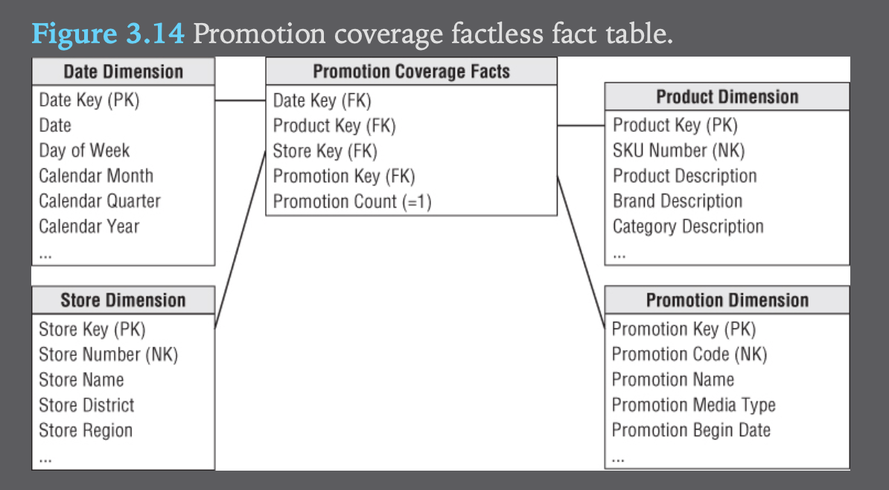
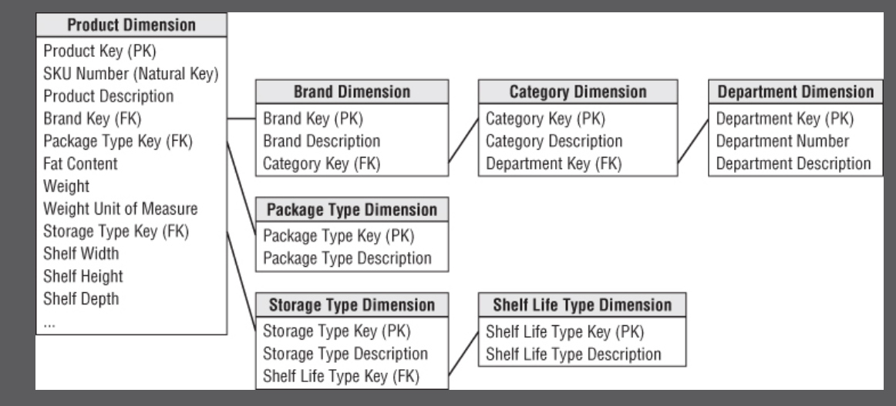
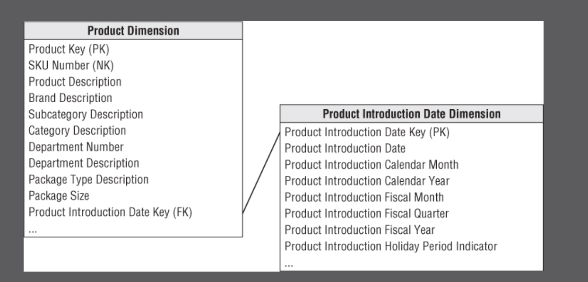
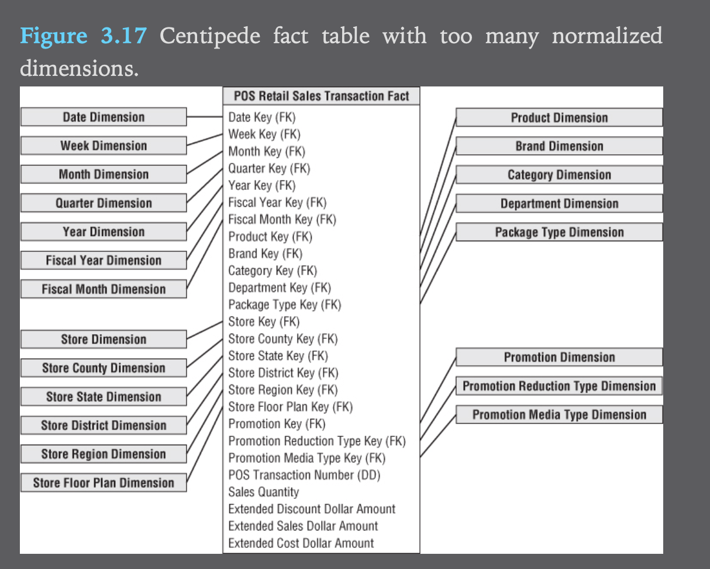

### Chapter 3 - Retail Sales
Most of the remaining chapters in this book are devoted to going through tangible examples of different industries- retail for this chapter.

The following concepts will be discussed:
- Four-step process for designing dimensional models
- Fact table granularity
- Transaction fact tables
- Additive, non-additive, and derived facts
- Dimension attributes, including indicators, numeric descriptors, and multiple hierarchies
- Calendar date dimensions, plus time-of-day
- Causal dimensions, such as promotion
- Degenerate dimensions, such as the transaction receipt number
- Nulls in a dimensional model
- Extensibility of dimension models
- Factless fact tables
- Surrogate, natural, and durable keys
- Snowflaked dimension attributes
- Centipede fact tables with too many dimensions

#### Step 1: Select the business process
A business process (BP) is a low-level activity such as taking orders or invoicing.
These processes have these characteristics:
- BP are frequently expressed as action verbs
- BP are supported by an operational system
- BP either generate or capture key performance metrics

Rarely will a business tell you the BP, you figure out the BP events based on the performance measurements users want to analyze.

If a business talks about business initiative rather than processes, generally, it involves decomposing the initiative to a business process.

A BP is not based on a department, if you focus on depts this will lead to duplicates.

#### Step 2: Declare the Grain
Declaring the grain means specifying what a `fact` table row represents, i.e 'how do you describe a single row in the fact table?'

Example grain declarations:
- One row per line item on a bill from a doctor
- One row per bank account each month

You should first declare the grain in business terms, rather than declaring the fact table's PK, even if they end up equating to the same thing.

The biggest mistake in dim modeling is forgetting this step!

#### Step 3: Identify the Dimensions
To figure out the dimensions, ask yourself 'How do business people describe the data resulting from the business process measurement events'?

Once you're clear about the grain, the dimensions can be easily identified as the
- who, what, where, when, why, how

#### Step 4: Identify the facts
To figure out the facts, ask yourself 'What is the process measuring?'

#### Final Point
When doing this 4 step process, don't dive directly into the source data, it's important to talk to the business people that will be using this data!

### Retail Case Study
Scenario:
- You work at the HQ of a grocery store.
- The business has 100 grocery stores, across 5 states
- Each store has different depts such as grocery, frozen foods
- Each store has 60k products, identified by their SKU

The data systems:
- Cashier register (POS)
- When vendors make deliveries

#### Step 1: Select the business process
The business process to model is the POS retail sales transactions.
Note that choosing which process to model first should be based on:
- criticalness
- feasibility

- In this scenario, management wants to understand customer purchases captured through POS system.
- This data enables the user to analyze which products are selling in which stores on which days under what promotional conditions in which transactions

#### Step 2: Declare the grain
Generally you want to identify the lowest atomic grain for the following reasons:
- The more detailed and atomic, the easier it is to translate into dimensions
- provides max analytical flexibility because it can be constrained or rolled up in all possible ways

In this scenario, the data should be at the level of a specific POS transaction. They won't necessarily need this data, but their requests may be to understand how shoppers took advantage of a .50 cents off promotion, and they need maximum flexibility for this.

#### Step 3: Identify the dimensions
- Once we know that we are interested in the POS transaction,  it is easy to come up with the dimensions.
- Within the framework of the primary dimension (the transaction in this case) we can ask whether other dimensions can be attributed to the POS measurement.

Here are the dims that apply:
- date
- product
- store
- promotion
- cashier
- method of payment
- POS transaction ticket number (as a degenerate dimension for transaction numbers)

After coming up with a grain statement, and the ensuing primary dimensions, if you want to add more dimensions, you can, however, they need to meet the following criteria:
- The additional dims should not cause duplicate rows in the fact table

#### Step 4: Identify the facts
Use the grain statement as a way to frame this decision, we know the grain is based on the individual product line item on the POS transaction.

The facts include:
- sales quantity
- per unit regular/discount/ net paid prices
- extended discount
- sales dollar amounts

#### Derived Facts
- You can compute gross profit yourself, yet it generally advised to store these derived facts in the table as well, as it guarantees the calculation is calculated consistently
- This more than makes up the cost of the extra storage cost

#### Non-additive facts
- Non-additive facts cannot be summarized along any dimension.
- Unit price is a good example of this

#### Transaction Fact Tables
Transactional business processes are the most common fact table type.
These fact tables have the following characteristics:
1. The grain of the transaction fact table is generally 1 row per transaction
2. These fact tables are highly dimensional

These tables are generally your largest table, when first designing it's important to estimate how many line items will be generated, looking at historical data is your best bet

### Dimension Table Details
#### Date Dimension
- The date dimension is the one dimension nearly guaranteed to be in the dim model
- Some may argue that a dim date table is not necessary since this logic can be derived using SQL date semantics
	- The author's counter-argument is that an average business user is not well versed with these SQL date utilities
	- Furthermore, there are some attributes such as holidays that SQL functions do not support

#### Flag and Indicators as Textual Attributes
- The author argues that for an example column called 'Holiday Indicator', rather than having values such as True/False or 1/0, it is better to have the value either be 'Holiday' or 'Non-Holiday', with one reason being if the user does a GROUP BY on the data, the grouped by row values will be much easier to interpret.

#### Current and Relative Date Attributes
- Most date attributes don't need to be updated, i.e Jun 13 will always roll up to Jun.
- Some attributes, such as 'isCurrentDay' will change over time
	- isCurrentDay will generally refer to yesterday's data, assuming the data is updated once a day

#### Time of day, dim or fact ??
- Time of day is usually separated from the date dim because while the date dimension includes ~7k rows for 20 years, if this grain was changed to 1 minute, 20 years worth of data would represent 10 million rows.
- Time of day should be a dim table if you plan on filtering or rolling up time periods based on groupings such as 15 min intervals, hours, shifts, etc
- If not rolling up by time of day groupings, then it should be a simple date/time fact in the fact table.

#### Product Dimension
The production dimension describes every SKU in the grocery store.

##### Flatten Many-to-one Hierarchies
The product dim represents the many descriptive attributes of each SKU.
- The merchandise hierarchy: SKU -> brands -> categories -> depts. Each of these is a many -> one relationship

- There are 300k unique SKU's, yet only 50 distinct department attributes.
	- That means that each distinct dept value will be repeated around 6000x (300k/50). This is completely acceptable

- Here are the attributes of the product dimensions table:

- Note that there are certain attributes such as 'package type' that don't belong in the merchandise hierarchy (not a brand, category, etc)

##### Attributes with Embedded Meaning
- Product codes sometimes have embedded meaning with different parts of the code representing significant characteristics of the product
- If this is the case, the dimension table should also include the broken down component parts as separate attributes

##### Numeric values as attributes or facts
- If the numeric value is used primarily for calculation purposes, it most likely belongs to the fact table
- If the numeric value changes infrequently, say a standard list price for a product, it may belong in the dim table instead

#### Drilling down on dimension attributes
- A reasonable product dimension could have 50+ descriptive attributes
- Drilling down in a dimensional model is nothing more than adding row header attributes from the dimension tables. Drilling up is removing row headers. You can drill down or up on attributes from more than one explicit hierarchy and with attributes that are part of no hierarchy.

### Store Dimension
- The store dimension describes every store in the grocery chain
#### Multiple Hierarchies in Dimension table
- You can roll up stores to any geographic attribute such as zip code, county, and state
- Contrary to popular belief city and state do not form a hierarchy, since there are many cities with the same name, you should include a city-state attribute instead

### Dates within Dimension Tables
- Referring to the store dimension diagram above, the 'first open date' could be a date column, but it is better to make them join keys to copies of the date dim table 

### Promotion Dimension
- The promotion dimension describes the promotion conditions under which a product is sold
- These include temporary price reductions, coupons, etc
- Here the author explains different factors that would determine if a promotion is successful or not, such as cannibalization, baseline comparison, etc

- The author then explains the design considerations of separating the 4 promotions

### Null FK, Attributes and Facts
- There needs to be a way to identify a null promotion key in the fact table
- Referential integrity is violated if you put a null FK in a fact table column. Therefore there needs to be a row in the dim table to identify that the dim is not applicable to the measurement
- It is recommended that rather than using null when a row has not been fully populated, to rather use a descriptive string such as 'Not Applicable' as null values are special and require special syntax to identify them
- Note that NULLS as metrics in the fact table is perfectly acceptable and should be used since they are properly handled in aggregate functions such as sum, and avg- substituting with zero would improperly skew the results

### Other Retail Sales Dimensions
- Any descriptive attribute that takes on a single value in the presence of a fact table measurement event is a good candidate to be added to an existing dim / it's own dim
- An example of this would be a cashier dimension. Note that if this dim was created, the cashier dim should have a 'No Cashier' row, similar to in the promo dimension for transactions that are processed without a cashier
- Payment method dim, trickier. This is what the author has to say: 
	- In real life, payment methods often present a more complicated scenario. 
	- If multiple payment methods are accepted on a single POS transaction, the payment method does not take on a single value at the declared grain.
	- Rather than altering the declared grain to be something unnatural such as one row per payment method per product on a POS transaction, you would likely capture the payment method in a separate fact table with a granularity of either one row per transaction (then the various payment method options would appear as separate facts) or one row per payment method per transaction (which would require a separate payment method dimension to associate with each row).

### Degenerate Dimensions for Transaction Numbers
- The retail sales fact table includes the POS transaction number on every line item row.
- In the transactional system, this transaction number would be the key to the rest of the transaction data, but in the dim model, you have already extracted this data.
- It is still important to keep this transaction number because 
	- it serves as the grouping key for pulling together all the products in a transaction
	- It allows you to link back to the operational system

- The POS transaction number may look like a dimension key, but the descriptive items have been stripped off - it's an empty dimension- this is why this is referred to as `degenerate dimension` (DD) 
-  Degenerate dimensions are very common when the grain of a fact table represents a single transaction
- Common examples of degenerate dimensions include
	- order numbers
	- invoice numbers

### Retail Schema in action

### Retail Schema Extensibility
- Let's say a few years after the initial implementation, we want to roll out a frequent shopper program.
- To handle this new addition, you need to create a frequent shopper dimension table and add a foreign key to the fact table
	- for transactions that happened before the implementation of this program, create a default dim surrogate key that corresponds to 'Prior to Frequent Shopper Program' dimension row/value
	- Also will need a default row for transactions that don't use a frequent shopper card
- Original schema was able to accommodate this new dimension because the initial data was modeled at its most granular level.
- Because dimension models are so extensible, here are some new features that are generally add-able without invaliding existing apps:
	1. new dimension attributes, if new attributes are discovered, new columns can be created. For values that are only available after a point in time, those values before can be populated with 'Not Applicable'.
	2. New dimensions: You can add the dimension to the fact table by adding a new FK and populating it correctly with values of the primary key from the dim table.
	3. New measured facts:
		- If the new fact is available at the same grain from the same measurement event, the fact can be easily added to the fact table.
		- If the new fact tables are only available from a point in time forward, populate missing values as NULL
		- If the fact occurs at a different grain, then a new fact table will need to be created.

### Factless Fact Tables
- There is one question that cannot be answered by the previous schema, what products were on promo but did not sell.
- The fact table records only SKU's that sell, if it included facts for SKU's that didn't sell, it would enlarge the table enormously.
- A solution to check what products didn't sell would be a promotion coverage fact table.
	- It would load one row for each product on promotion in a store each day
- To facilitate counting, you can include a dummy fact such as promotion count and set it to a constant of 1
- to determine what promotions didn't sell, you would
	1. query the promotion table to determine all possible products
	2. query against fact table to determine promotions that sold
	3. Figure out the set difference between the two lists above

### Dimension and Fact Table Keys
#### Dimension Table Surrogate Keys
- The unique primary key of a dimension table should be a surrogate key, rather than relying on the operational system identifier (natural key).
- surrogate keys are integers that are assigned sequentially to populate a dimension
- Sometimes modelers want to use the natural key instead, however natural keys logic can eventually be invalidated
- The analogy is that while NK may be faster to implement, and there's a small amount of pain to first use a surrogate key, it's like a flu-shot since in the long run, it reduces the risk of re-work.
- Here are several advantages
	- Buffer the DWH from operational changes. Sometimes operational systems will re-use keys after x months of inactivity, but DWH may retain this data for years, as such DWH may become vulnerable to key overlaps if using NK
	- Integrate multiple source systems
	- Improve performance: The smallest integer possible, whereas a NK can sometimes be a bulky string
	- Handle null or unknown conditions: special surrogate key values are used to record dimension conditions that may not have an operational code
	- Support dimension attribute change tracking: One of the primary techniques for handling changes to dim attributes relies on surrogate keys to handle the multiple profiles of a single natural key

### Dimension Natural and Durable Supernatural Keys
- If the natural key comes from multiple sources, you may pre-pend the source system, i.e. CRM|654990
- Natural keys are often composed of constituent parts, in the dim table, these components should be split apart and made available as separate attributes
- In a dim table with attribute change tracking, it's important that you have an identifier that reliably identifies that attribute over attribute changes
- For these situations a permanent durable identifier known as a supernatural key is necessary

#### Degenerate Dimension Surrogate keys
- Although surrogate keys aren't typically assigned to degenerate dimensions, there are some situations in which a surrogate key is necessary
	- For example, if a POS system wraps back to zero and re-uses previous control numbers

#### Date Dimension Smart Keys
- The date dimension has unique characteristics and requirements:
	- Calendar dates are fixed
	- Don't have to worry about handling unexpected dates
- Most commonly the PK of a date dim is an integer formatted like yyyymmdd. 
	- This key is not meant to be used directly in the fact table, rather it should be used to join the dim table for better performance
	- What this key is meant for is to partition fact tables
- Another alternative to the yyyymmdd key is using a true date type column
	- This should only be used if the optimizer incorporates date type intelligence

#### Fact Table Surrogate Keys
- While a surrogate key is necessary in a dim table, it's not necessary in a fact table unless it's for back room ETL processing
- The surrogate key for a fact table won't provide query performance, but it does offer the following benefits:
1. Immediate unique identification
2. Backing out or resuming a bulk load
	- If a large number rows are being loaded and it's stopped halfway, the DBA can simply figure out the max key in the table and then resume the load from the correct pt
	- Replacing updates with inserts plus deletes
	- Using the fact table surrogate key as a parent in a parent/child schema: In cases where there is a child lower grain fact table, the surrogate key in the parent table is also exposed in the child table.

### Resisting Normalization Urges
- We discard normalization for ease of use and performance, not transactional efficiencies
#### Snowflake Schemas with Normalized Dimensions
- The flattened, denormalized dim tables with repeating values makes data modelers uncomfortable, as it uses up a lot more space
- They also say that normalized dim tables are easier to maintain
- Dim table normalization is referred to as snowflaking
	- Redundant attributes are removed from the flat, denormalized dimension table and placed in separate normalized dimension tables

- the snowflake design really balloons the number of necessary tables

- Not recommended for the following reasons
	1. Makes for a much more complex presentation
	2. Database optimizers struggle with snowflaked schemas
	3. Minor disk space saving insignificant
	4. Negatively impacts user ability to browse within dimension
	5. SQL becomes complex
	6. Defeats the point of indexes

#### Outriggers
- Sometimes snowflaking is permissions to build an outrigger dimension

- It only makes sense to outrigger a primary dimension table's date attribute if the business wants to filter and group this date by nonstandard calendar attributes, such as the fiscal period, business day indicator, or holiday period. Otherwise, you could just treat the date attribute as a standard date type column in the product dimension.

#### Centipede Fact Tables with Too many Dimensions
- Centipede fact tables are those where normally compact fact tables have suddenly turned into unruly monster that join dozens of dimension tables, here's an example

- This leads to extra fact table disk space requirements
 	- While it's okay for dim tables to take up many cols, due to their low row count, it's much worse for fact tables to take up many columns because they naturally have a high row count
- Most business processes can be represented with less than 20 dimensions in the fact table.
	- If a design has 25 or more dimensions, you should look for ways to combine correlated dimensions into a single dimension.
	- Perfectly correlated attributes, such as the levels of a hierarchy, as well as attributes with a reasonable statistical correlation, should be part of the same dimension.
- [Columnar databases](https://docs.aws.amazon.com/redshift/latest/dg/c_columnar_storage_disk_mem_mgmnt.html) reduce the query/storage penalties associated with wide centipede fact tables

### Summary
- Regardless of industry, it's strongly encouraged to use the 4-step process, the author stresses especially clearing stating the grain
- Loading the fact table with atomic data provides the greatest flexibility
- Popular your dim tables with verbose, robust descriptive attributes

