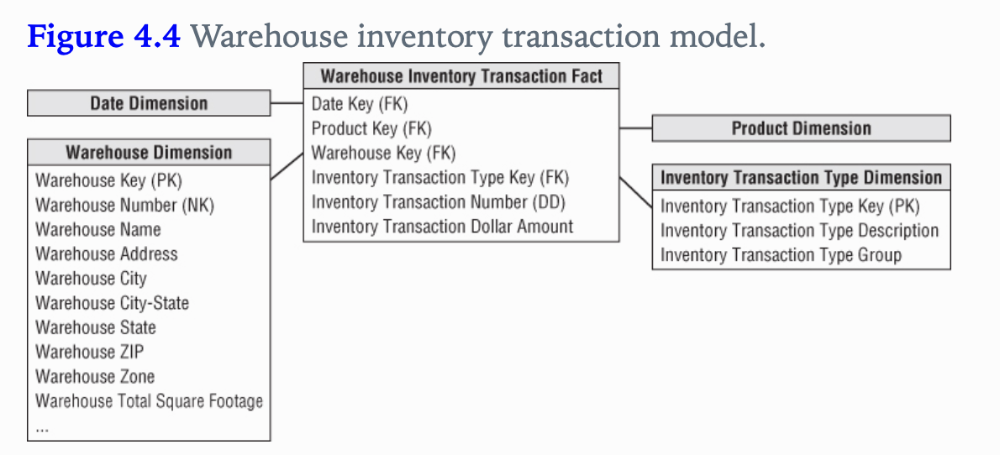
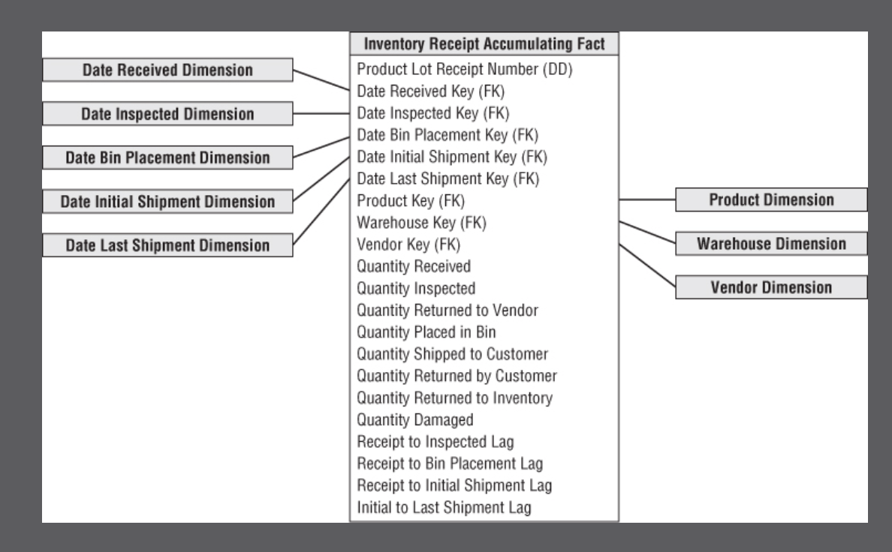
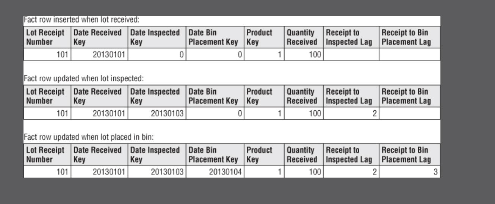
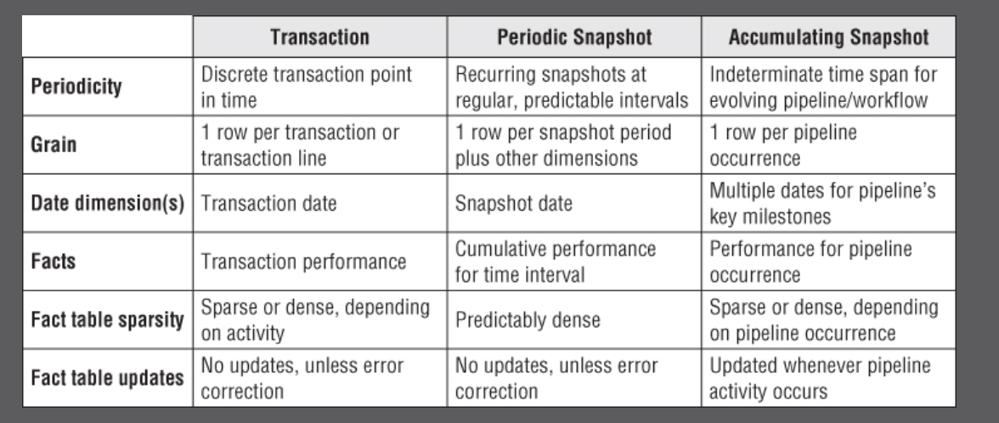
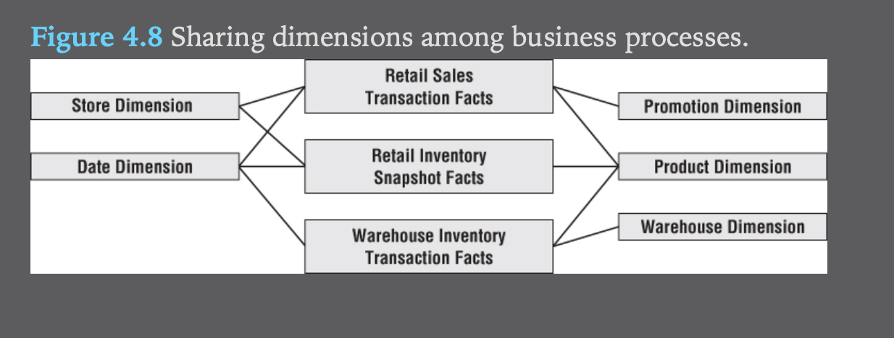

## Inventory
- We remain the same industry as retail, but we move up the value chain to tackle the inventory process.
- This chapter will provide a thorough discussion of the enterprise data warehouse bus architecture.
- Underscore the importance of using conformed dimensions and facts

Concepts to discuss:
1. represent org value chains via series of dim models
2. semi-additive facts
3. Three fact table types
	1. periodic snapshots
	2. transactions
	3. accumulating snapshots
4. Enterprise DWH bus architecture and matrix
5. Opportunity / stakeholder matrix
6. Conformed dims and facts
7. Data governance

### Value Chain Intro
The value chain illustrated:

- Operational source systems typically produce transactions or snapshots at each step of the value chain.
- The primary objective of the DW/BI system is to monitor the performance of each process.
- Each process produces unique metrics at unique time intervals with unique granularity and dimension which means we will need separate fact tables`

### Inventory Models
Several inventory models to discuss:
1. Inventory periodic snapshot - product inventory levels are measured at regular intervals and placed as separate regular intervals and placed as separate rows in a fact table.
2. Transaction - every transaction is recorded
3. Inventory accumulating snapshot: fact table row is inserted for each product delivery

Each fact table tells a different story, and depending on the requirements, 2 or even all 3 of the models is necessary.

#### Inventory Periodic Snapshot
Optimizing inventory levels at the store has a major impact on profitability.
Let's start with the 4 step dim design process:
1. Business process: analyzing periodic snapshotting of retail store inventory.
2. Grain: the most atomic level of detail provided is a daily inventory for each product in each store.
3. Dimensions: date,product, store
4. Fact: quantity on hand

- The date dimension is identical to the table from Retail.
- The product dimension could be enhanced with columns such as minimum reorder quantity
	- note that if miniumum reorder quanitty differs for a product by store, then it can't be a dim attribute.
- Even a sparse fact table such as in figure 4.2 is useful.
- One challenge faced in this fact table is that inventory need to contain a row for every product that doesn't exist, as well as inventory that does exist. 
	- This can lead to big tables. 
	- A compromise is to reduce daily snapshots to just the last 60 days and then revert to maybe a weekly snapshot.

#### Semi-Additive Facts
- Inventory levels, however, are not additive across dates because they represent snapshots of a level or balance at one point in time.
- Since inventory levels are additive across some dimensions, but not all, we refer to them as semi-additive facts.

#### Enhanced Inventory Facts
- Currently the fact table only includes quantity on hand, if we want to do additional analysis, we need to include additional facts such as 
	-	number of turns ( quantity sold / quantity on hand)
	- number of days supplies ( quantity on hand / average quantity sold)
	- extended value of the inventory at cost
	- value of the latest selling price
- Notice that quantity on hand is semi-additive while the other facts are additive

### Inventory Transactions

1. A second way to model an inventory business project is to record every transaction that affects inventory
2. The transaction fact table is useful for measuring frequency and timing of specific transaction types
3. However, we cannot just use the transaction fact table as the sole basis for analyzing inventory performance
	- Remember there's more to life than transactions alone. Some form of a snapshot table to give a more cumulative view of a process often complements a transaction fact table.
4. Side note: If performance measurements have different natural granularity or dimensionality, they likely result from separate processes that should be modeled as separate fact tables.

### Inventory Accumulating Snapshots
- Accumulating snapshot fact tables are used for processes that have a definite beginning, definite end, and identifiable milestones in between.
- In this inventory model, one row is placed in the fact table when a particular product is received at the warehouse. 
- Accumulating snapshots are most appropriate when business users want to perform workflow or pipeline analysis.

The evolution of the fact table:

### Fact Table Types
The 3 fact tables have been covered, they are quite different but often times you need two complementary fact tables to get a complete picture of the business

### Transaction Fact Tables
- Transaction data is the most naturally dimensional data and you can analyze behavior to whatever detail you like
- However, we cannot rely solely on transactions alone

### Periodic Snapshot Fact Tables
- Periodic snapshots are needed to see the cumulative performance of the business at regular, predictable time intervals.
- Unlike the transaction fact table where a row is loaded for each event occurrence, with the periodic snapshot, you take a picture (hence the snapshot terminology) of the activity at the end of a day, week, or month, then another picture at the end of the next period, and so on.
- The periodic snapshots are stacked consecutively into the fact table.
- The periodic snapshot fact table often is the only place to easily retrieve a regular, predictable view of longitudinal performance trends.

- The daily snapshots are aggregations of the individual transactions.
- The snapshot and transactional fact tables share many dimensionn tables
	- generally the snapshot table has few overall dim tables.
	- conversely, the snapshot table will have more facts

The reason for using periodic over transactions is because:
- In many businesses, transaction details are not easily summarized to present management performance metrics.
- As you saw in this inventory case study, crawling through the transactions would be extremely time-consuming, plus the logic required to interpret the effect of different kinds of transactions on inventory levels could be horrendously complicated, presuming you even have access to the required historical data.

### Accumulating Snapshot Fact table
- skipped, nothing new

### Enterprise Data Warehouse Bus Architecture
#### Understanding Bus Architecture

- The term bus refers to common structure to which everything connects from and derives power
- The master suite of standardized dimensions and facts has a uniform interpretation across the enterprise.
- This establishes the data architecture framework.
-	You can then tackle the implementation of separate process-centric dimensional models, with each implementation closely adhering to the architectur

#### Bus Matrix

- The business processes are the matrix rows. These rows will later translate into dimensional models
- Start with a single business process row 

- The columns of the bus matrix represent the common dimensions used. 
- Start with creating a list of core dimensions before filling the matrix

#### Bus Matrix mistakes
Matrix row mistakes (business processes):
- Shouldn't be based off of departments or teams
- Shouldn't represent a list of reports, should represent business processes

Matrix column mistakes (dimensions)
- Overly generalized columns, for example a 'person' column wouldn't be useful
- Separate columns for each level of the hierarchy. For example, maybe one of the dimensions needs to be weekly, it would be a mistake to create a column just for that if you already have a column for the date. It's important to retain the overarching identification of common dimensions deployed at different levels of granularity.

#### Retrofitting Existing Models to a bus matrix
- Sometimes there are existing, standalone dimensions that already exist
- You need to develop an incremental plan to integrate these dim models to the enterprise architecture.
- If the existing dim model is riddled with errors, the effort to retrofit these models may exceed the effort to start from scratch

### Conformed Dimensions
#### Drilling Across Fact Tables
- conformed dimensions enable you to combine performance measurements from different business processes in a single report

#### Identical Conformed Dims
- conformed dimensions mean the same thing with every possible fact table to which they are joined. The date dimension table connected to the sales facts is identical to the date dimension table connected to the inventory facts.
- These conformed dimensions may be in the same database or more commonly due to the complexity of most DW systems, the dimension is built once in the ETL system and then duplicated.

### Shrunken Conformed Dimension with Row Subset
### Shrunken Conformed Dimensions on the Bus Matrix
### Limited Conformity
### Importance of Data Governance and Stewardship
#### Business-Driven Governance
#### Governance Objectives
#### Conformed Dimensions and the Agile Movement
### Conformed Facts
### Summary
- Discussed 3 different kinds of fact tables, periodic, accumulating, and transaction
- Enterprise data warehouse bus and matrix: each business process is supported by a primary source system, translates into a row in the bus matrix and eventually a dim model
- Conformed dimensions are a must if you want to build a integrated set of dim models

