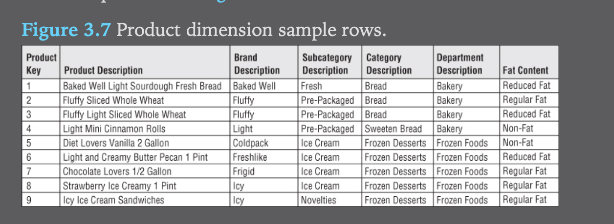
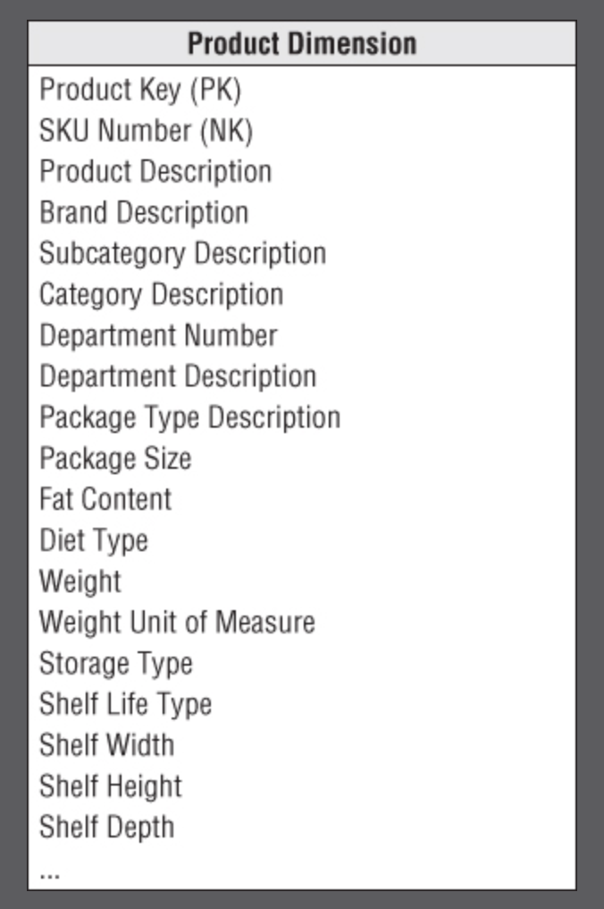
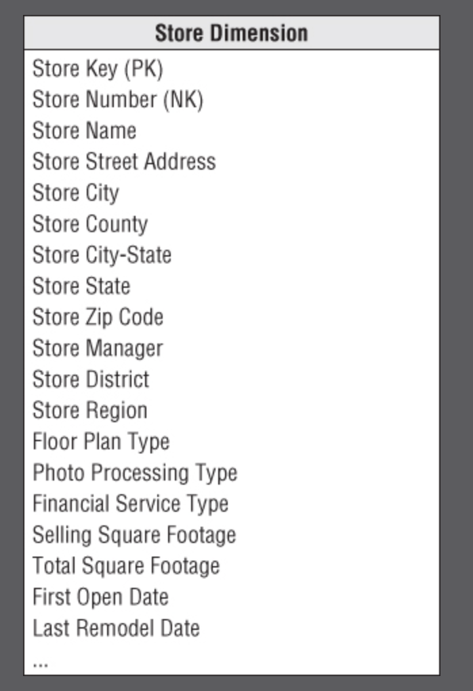

### Chapter 3 - Retail Sales
Most of the remaining chapters in this book are devoted to going through tangible examples of different industries- retail for this chapter.

The following concepts will be discussed:
- Four-step process for designing dimensional models
- Fact table granularity
- Transaction fact tables
- Additive, non-additive, and derived facts
- Dimension attributes, including indicators, numeric descriptors, and multiple hierarchies
- Calendar date dimensions, plus time-of-day
- Causal dimensions, such as promotion
- Degenerate dimensions, such as the transaction receipt number
- Nulls in a dimensional model
- Extensibility of dimension models
- Factless fact tables
- Surrogate, natural, and durable keys
- Snowflaked dimension attributes
- Centipede fact tables with too many dimensions

#### Step 1: Select the business process
A business process (BP) is a low-level activity such as taking orders or invoicing.
These processes have these characteristics:
- BP are frequently expressed as action verbs
- BP are supported by an operational system
- BP either generate or capture key performance metrics

Rarely will a business tell you the BP, you figure out the BP events based on the performance measurements users want to analyze.

If a business talks about business initiative rather than processes, generally, it involves decomposing the initiative to a business process.

A BP is not based on a department, if you focus on depts this will lead to duplicates.

#### Step 2: Declare the Grain
Declaring the grain means specifying what a `fact` table row represents, i.e 'how do you describe a single row in the fact table?'

Example grain declarations:
- One row per line item on a bill from a doctor
- One row per bank account each month

You should first declare the grain in business terms, rather than declaring the fact table's PK, even if they end up equating to the same thing.

The biggest mistake in dim modeling is forgetting this step!

#### Step 3: Identify the Dimensions
To figure out the dimensions, ask yourself 'How do business people describe the data resulting from the business process measurement events'?

Once you're clear about the grain, the dimensions can be easily identified as the
- who, what, where, when, why, how

#### Step 4: Identify the facts
To figure out the facts, ask yourself 'What is the process measuring?'

#### Final Point
When doing this 4 step process, don't dive directly into the source data, it's important to talk to the business people that will be using this data!

### Retail Case Study
Scenario:
- You work at the HQ of a grocery store.
- The business has 100 grocery stores, across 5 states
- Each store has different depts such as grocery, frozen foods
- Each store has 60k products, identified by their SKU

The data systems:
- Cashier register (POS)
- When vendors make deliveries

#### Step 1: Select the business process
The business process to model is the POS retail sales transactions.
Note that choosing which process to model first should be based on:
- criticalness
- feasibility

#### Step 2: Declare the grain
Generally you want to identify the lowest atomic grain for the following reasons:
- The more detailed and atomic, the easier it is to translate into dimensions
- provides max analytical flexibility because it can be constrained or rolled up in all possible ways

In this scenario, the data should be at the level of a specific POS transaction. They won't necessarily need this data, but their requests may be to understand how shoppers took advantage of a .50 cents off promotion, and they need maximum flexibility for this.

#### Step 3: Identify the dimensions
Once we know that we are interested in the POS transaction,  it is easy to come up with the grain:
- date
- product
- store
- promotion
- cashier
- method of payment
- POS transaction ticket number (as a degenerate dimension for transaction numbers)

After coming up with a grain statement, and the ensuing primary dimensions, if you want to add more dimensions, you can, however, they need to meet the following criteria:
- The additional dims should not cause duplicate rows in the fact table

#### Step 4: Identify the facts
Use the grain statement as a way to frame this decision, we know the grain is based on the individual product line item on the POS transaction.

The facts include:
- sales quantity
- per unit regular/discount/ net paid prices
- extended discount
- sales dollar amounts

#### Derived Facts
- You can compute gross profit yourself, yet it generally advised to store these derived facts in the table as well, as it guarantees the calculation is calculated consistently
- This more than makes up the cost of the extra storage cost

#### Non-additive facts
- Non-additive facts cannot be summarized along any dimension.
- Unit price is a good example of this

#### Transaction Fact Tables
- transactional business processes are the most common
These fact tables have the following characteristics:
1. The grain of the transaction fact table is generally 1 row per transaction
2. These fact tables are highly dimensional

These tables are generally your largest table, when first designing it's important to estimate how many line items will be generated, looking at historical data is your best bet

### Dimension Table Details
#### Date Dimension
- The date dimension is the one dimension nearly guaranteed to be in the dim model
- Some may argue that a dim date table is not necessary since this logic can be derived using SQL date semantics
	- The author's counter-argument is that an average business user is not well versed with these SQL date utilities
	- Furthermore, there are some attributes such as holidays that SQL functions do not support

#### Flag and Indicators as Textual Attributes
- The author argues that for an example column called 'Holiday Indicator', rather than having values such as True/False or 1/0, it is better to have the value either be 'Holiday' or 'Non-Holiday', with one reason being if the user does a GROUP BY on the data, the grouped by row values will be much easier to interpret.

#### Current and Relative Date Attributes
- Most date attributes don't need to be updated, i.e Jun 13 will always roll up to Jun.
- Some attributes, such as 'isCurrentDay' will change over time
	- isCurrentDay will generally refer to yesterday's data, assuming the data is updated once a day

#### Time of day, dim or fact ??
- Time of day is usually separated from the date dim because while the date dimension includes ~7k rows for 20 years, if this grain was changed to 1 minute, 20 years worth of data would represent 10 million rows.
- Time of day should be a dim table if you plan on filtering or rolling up time periods based on groupings such as 15 min intervals, hours, shifts, etc
- If not rolling up by time of day groupings, then it should be a simple date/time fact in the fact table.

#### Product Dimension
The production dimension describes every SKU in the grocery store.

##### Flatten Many-to-one Hierarchies
The product dim represents the many descriptive attributes of each SKU.
- The merchandise hierarchy: SKU -> brands -> categories -> depts. Each of these is a many -> one relationship

- There are 300k unique SKU's, yet only 50 distinct department attributes.
	- That means that each distinct dept value will be repeated around 6000x (300k/50). This is completely acceptable

- Here are the attributes of the product dimensions table:

- Note that there are certain attributes such as 'package type' that don't belong in the merchandise hierarchy (not a brand, category, etc)

##### Attributes with Embedded Meaning
- Product codes sometimes have embedded meaning with different parts of the code representing significant characteristics of the product
- If this is the case, the dimension table should also include the broken down component parts as separate attributes

##### Numeric values as attributes or facts
- If the numeric value is used primarily for calculation purposes, it most likely belongs to the fact table
- If the numeric value changes infrequently, say a standard list price for a product, it may belong in the dim table instead

#### Drilling down on dimension attributes
- A reasonable product dimension could have 50+ descriptive attributes
- Drilling down in a dimensional model is nothing more than adding row header attributes from the dimension tables. Drilling up is removing row headers. You can drill down or up on attributes from more than one explicit hierarchy and with attributes that are part of no hierarchy.

### Store Dimension
- The store dimension describes every store in the grocery chain
#### Multiple Hierarchies in Dimension table
- You can roll up stores to any geographic attribute such as zip code, county, and state
- Contrary to popular belief city and state do not form a hierarchy, since there are many cities with the same name, you should include a city-state attribute instead

### Dates within Dimension Tables
- Referring to the store dimension diagram above, the 'first open date' could be a date column, but it is better to make them join keys to copies of the date dim table 

### Promotion Dimension
- The promotion dimension describes the promotion conditions under which a product is sold
- These include temporary price reductions, coupons, etc
- Here the author explains different factors that would determine if a promotion is successful or not, such as cannibalization, baseline comparison, etc

- The author then explains the design considerations of separating the 4 promotions

### Null FK, Attributes and Facts
- There needs to be a way to identify a null promotion key in the fact table
- Referential integrity is violated if you put a null in a fact table column. Therefore there needs to be a row in the dim table to identify that the dim is not applicable to the measurement
- It is recommended that rather than using null when a row has not been fully populated, to rather use a descriptive string such as 'Not Applicable' as null values are special and require special syntax to identify them
- Note that NULLS as metrics in the fact table is perfectly acceptable and should be used since they are properly handled in aggregate functions such as sum, and avg- substituting with zero would improperly skew the results

### Other Retail Sales Dimensions
- Any descriptive attribute that takes on a single value in the presence of a fact table measurement event is a good candidate to be added to an existing dim / it's own dim
- An example of this would be a cashier dimension. Note that if this dim was created, the cashier dim should have a 'No Cashier' row, similar to in the promo dimension for transactions that are processed without a cashier
- Payment method dim, trickier. This is what the author has to say: 
	- In real life, payment methods often present a more complicated scenario. 
	- If multiple payment methods are accepted on a single POS transaction, the payment method does not take on a single value at the declared grain.
	- Rather than altering the declared grain to be something unnatural such as one row per payment method per product on a POS transaction, you would likely capture the payment method in a separate fact table with a granularity of either one row per transaction (then the various payment method options would appear as separate facts) or one row per payment method per transaction (which would require a separate payment method dimension to associate with each row).

### Degenerate Dimensions for Transaction Numbers
