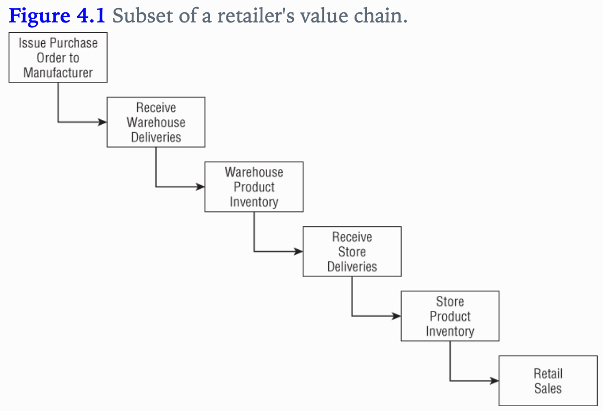

## Inventory
- We remain the same industry as retail, but we move up the value chain to tackle the inventory process.
- This chapter will provide a thorough discussion of the enterprise data warehouse bus architecture.
- Underscore the importance of using conformed dimensions and facts

Concepts to discuss
1. represent org value chains via series of dim models
2. semi-additive facts
3. Three fact table types
	1. periodic snapshots
	2. transactions
	3. accumulating snapshots
4. Enterprise DWH bus architecture and matrix
5. Opportunity / stakeholder matrix
6. Conformed dims and facts
7. Data governance

### Value Chain Intro
The value chain illustrated:

### Inventory Models
Several inventory models to discuss:
- Inventory periodic snapshot - product inventory levels are measured at regular intervals and placed as separate regular intervals and placed as separate rows in a fact table.
- Transaction - every transaction is recorded
- Inventory accumulating snapshot: fact table row is inserted for each product delivery

#### Inventory Periodic Snapshot
Optimizing inventory levels at the store has a major impact on profitability.
Let's start with the 4 step dim design process:
1. Business process: analyzing periodic snapshotting of  retail store inventory.
2. Grain: the most atomic level of detail provided is a daily inventory for each product in each store.
3. Dimensions: date,product, store
4. Fact: quantity on hand

- The date dimension is identical to the table from Retail.
- The product dimension could be enhanced with columns such as minimum reorder quantity
- Even a sparse fact table such as in figure 4.2 is useful. One challenge faced in this fact table is that inventory need to contain a row for every product that doesn't exist, as well as inventory that does exist. This can lead to 

#### Semi-Additive Facts
- Inventory levels, however, are not additive across dates because they represent snapshots of a level or balance at one point in time.
- Since inventory levels are additive across some dimensions, but not all, we refer to them as semi-additive facts.

#### Enhanced Inventory Facts

### Inventory Transactions
1. A second way to model an inventory business project is to record every transaction that affects inventory
2. The transaction fact table is useful for measuring frequency and timing of specif transaction types
3. However, we cannot just use the transaction fact table as the sole basis for analyzing inventory performance
	- Remember there's more to life than transactions alone. Some form of a snapshot table to give a more cumulative view of a process often complements a transaction fact table.
4. Side note: If performance measurements have different natural granularity or dimensionality, they likely result from separate processes that should be modeled as separate fact tables.

### Inventory Accumulating Snapshots
- Accumulating snapshot fact tables are used for processes that have a definite beginning, definite end, and identifiable milestones in between.
- In this inventory model, one row is placed in the fact table when a particular product is received at the warehouse. 
- Accumulating snapshots are most appropriate when business users want to perform workflow or pipeline analysis.

The evolution of the fact table:

### Fact Table Types
The 3 fact tables have been covered, they are quite different but often times you need two complementary fact tables to get a complete picture of the business

### Transaction Fact Tables
- Transaction data is the most naturally dimensional data and you can analyze behavior to whatever detail you like
- However, we cannot rely solely on transactions alone

### Periodic Snapshot Fact Tables
- Periodic snapshots are needed to see the cumulative performance of the business at regular, predictable time intervals.
- Unlike the transaction fact table where a row is loaded for each event occurrence, with the periodic snapshot, you take a picture (hence the snapshot terminology) of the activity at the end of a day, week, or month, then another picture at the end of the next period, and so on.
- The periodic snapshots are stacked consecutively into the fact table.
- The periodic snapshot fact table often is the only place to easily retrieve a regular, predictable view of longitudinal performance trends.

The reason for using periodic over transactions is because:
- In many businesses, however, transaction details are not easily summarized to present management performance metrics.
- As you saw in this inventory case study, crawling through the transactions would be extremely time-consuming, plus the logic required to interpret the effect of different kinds of transactions on inventory levels could be horrendously complicated, presuming you even have access to the required historical data.
