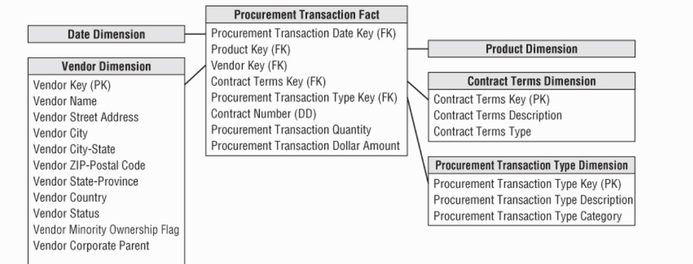
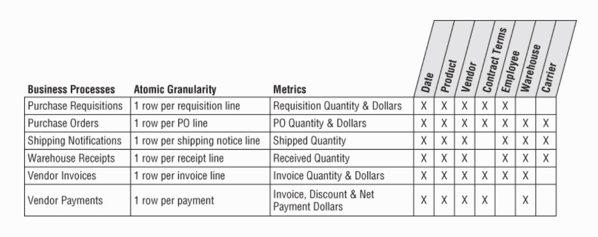
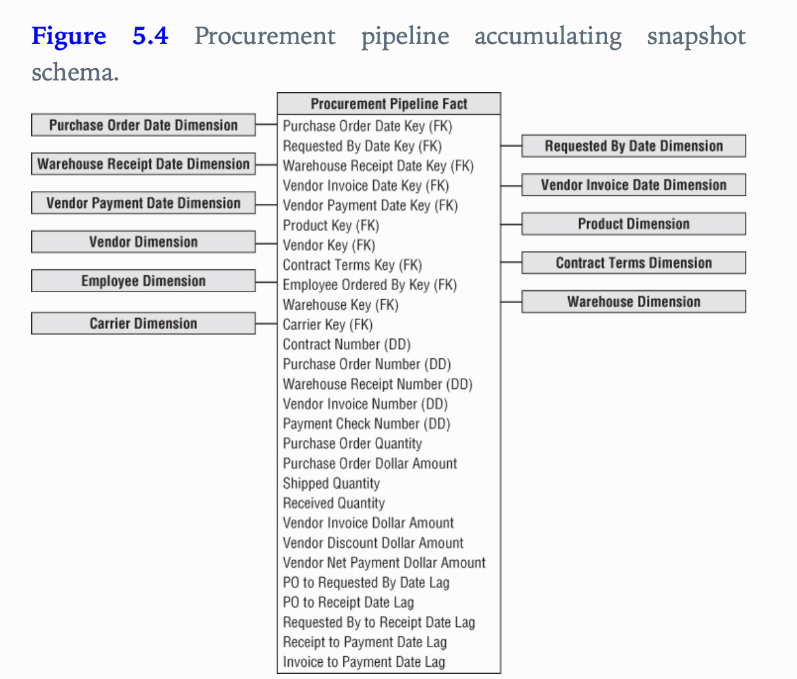
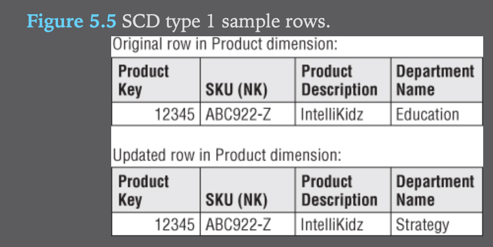

## Chapter 5 - Procurement
Key concepts:
- Blended versus seperate transaction schemas/tables
- Slowly changing dimensions
### Procurement Case Study
- For many companies, procurement is a critical business activity. Effective procurement of products at the right price for resale is obviously important to retailers and distributors.

### Procurement Transactions and Bus Matrix
- As you work through the four-step dimensional design process, you determine that the procurement is the business process to be modeled.
- You could initially design a fact table with the grain of one row per transaction date, product, vendor, contract terms
- The procurement transaction quantity and dollar amount are the facts

- The vendor dimension contains one row for each vendor, along with interesting descriptive attributes to support a variety of vendors.
- The contract terms dimension contains one row for each generalized set of dimensions.

### Single vs Multiple Transaction Fact Tables
- As you review the initial procurement schema design with business users, you learn several new details.
- First the business users describe the various procurement transactions differently.
- To the business, purchase orders, shipping notices, warehouse receipts are viewed as separate and unique processes
- Furthermore, you discover several transaction types have different dimensions, for example discounts taken are applicable to vendor payments, but not to other transaction types.
- As you sort through these new details, you are faced with a design decision. 
	- Should you build a blended transaction fact table with a transaction type dimension to view all procurement transactions together, or do you build separate fact tables for each transaction type? 
	-	This is a common design quandary that surfaces in many transactional situations, not just procurement.
- The following considerations help sort out these decisions
	1. What are the user analytical requirements?
		- How will the business users most commonly analyze this data?
	2. Are there multiple unique business processes?
		- It seems that buying products is distintcly different from receiving products
	3. Are multiple source systems capturing metrics with unique granularities?
		- There are three seperate source systems in this example: purchasing, warehousing, and accounts payable, this would suggest seperate fact tables.
	4. What is the dimensionality of the facts?
		- In this example, several dimensions are applicable to some transaction types, but not to others. This would again lead you to seperate fact tables.

- A simple way to measure these trade-offs is to use the bus matrix, using two additional columns that identify the atomic granularity, and metrics for each row. Here is an example bus matrix:

Here is the updated dimensional model using multiple fact tables:

### Complementary Procurement Snapshot
- May need to develop a snapshot fact table to fully address the business's needs.
- An accumulating snapshot such as Figure 5.4 that crosses processes would be extremely useful if the business is interested in monitoring product movement as it proceeds through the procurement pipeline

### Slowly Changing Dimensions
#### Type 0: Retain Original
- The dimension attribute value never changes

#### Type 1: Overwrite
- You overwrite the old attribute value in the dimension row, replacing it with the current value, the attribute always reflects the most recent assignment

In this diagram above, the dept name changed on Feb 1 from Education -> Strategy. Let's say that sales took off shortly after, you would have no information linking this performance improvement to the change in depts.

Type 1 is the simplest approach, but one issue is that you lose all history of attribute changes.

#### Type 2: Add a new row
- This is main technique for supporting represent correct history

- The type 2 response is the primary workhorse technique for accurately tracking slowly changing dimension attributes. It is extremely powerful because the new dimension row automatically partitions history in the fact table.

#### type 2 Effective and Expiration Dates
