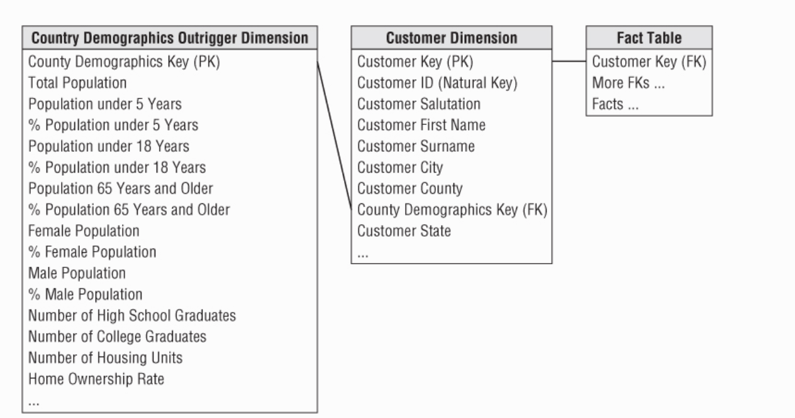

## Chapter 8: Customer Relationship Management
Concepts to discuss:
1. CRM Overview
2. Customer name and address parsing
3. Handling of dates, aggregated facts, and segmentation behavior
4. Outriggers for low cardinality attributes
5. Bridge tables for sparse attributes
6. Bridge tables for multiple customer contacts
7. Behavior study groups to capture cohort groups
8. Step dimensions to analyze sequential customer behavior
9. timespan fact tables with effective and expiration dates
10. Embellishing fact tables with dimensions
11. Integrating customer data during downstream ETL process
12. Warning about fact to fact table joins
12. reality check on real time

### CRM Overview
- Customer Relationship management is based on the idea that the better you know your customers the better you can maintain a longer lasting relationship with them.

### Customer Dimension Attributes
- The customer dimension is the typically the most challenging dimension for any DWH system as it can be many rows, and also many columns

- We'll begin with name/address parsing and other common customer attributes, including coverage of dimension outriggers, and then move on to other interesting customer attributes.

### Name and Address Parsing
- This can actually be pretty tricky because the entered customer data isn't standardized, for example suite might be spelled 'st'. This data needs to be broken down into as many elemental parts as possible

Here is an example of the parsed data:

### International Name and Address Considerations
- This is a huge consideration if your customers are abroad, unicode is the standard character set to use when addressing international characters

#### International DW/BI Goals
List a series of goals for international considerations

### Customer-Centric Dates
- Customer dimensions often contain dates, such as the date of the first purchase, date of last purchase, and the date of birth

### Aggregated Facts as Dimension Attributes
- Providing aggregated facts as dimension attributes is sure to be a crowd-pleaser with the business users.
- They could issue a query to identify all customers who satisfied the spending criteria and then issue another fact query to analyze the behavior for that customer dimension subset.
- But rather than all that, you can instead store an aggregated fact as a dimension attribute. This allows business users to simply constrain on the spending attribute just like they might on a geographic attribute.

3
### Segmentation Attributes and Scores
For an individual customer, here are some common segmentation attributes:
- Gender
- Ethnicity
- Age, or life stage classifications
- Income
- Status (new, active, inactive, closed)
- Referring source
- business specific market segment

#### Behavior Tag Time Series
- One popular approach for scoring and profiling customers looks at recency, frequency and intensity
- Recency: how many days has it been since the customer last ordered or visited your site
- Frequency: how many times the customer has ordered or visited
- Intensity: how much the customer has spent over the same time period

### Counts with Type 2 Dimension Changes
-  If you used type 2 to track customer dimension changes, you need to be careful to avoid overcounting because you have multiple rows in the customer dimension for the same individual
	- One way to solve is doing a `count distinct`
	- Alternatively could use an is_current_row flag

### Outrigger for Low Cardinality Attribute set
- Generally snowflaking is not advised, but there are some special situations where it might be good.
- In Figure 8.6, the dimension outrigger is a set of data from an external data provider consisting of 150 demographic and socio-economic attributes regarding the customers' county of residence.

Here are a few reasons why we are breaking the 'no snowflake rule':
- The demographic data is available at a significantly different grain than the primary dimension data
- It is also loaded at different times than the rest of the data in the customer dimension
- Significant space can be saved if the underlying customer dimension is large

### customer Hierarchy considerations

#### Bridge Tables for Multivalued Dimensions
- Let's say that you choose to use transactions as the grain.
- In this case, you would require any dimension attached to this fact table to take on a single value.
	- examples of this are customer, location, product, or service
- However, you may have some problem dimensions that take on multiples values at the grain of the individual transaction such as:
	- demographic descriptors
	- Contact addresses
	- Professional skills of job applicant
- When faced with multivalued dimension, there are two basic choices, a positional design or bridge table design.
- The positional design means that for each hobby, i.e hobby_5, there is a column for that
	- pros: It's easy to implement
	- cons: not scale-able (takes too many columns), and lots of null value columns (a member will have a null value if they don't have a hobby_5, or even a hobby_20)
- The bridge table approach takes care of the cons of the above approach, but it requires a complex query that is hidden from the business user.

### Bridge Tables for Sparse Attributes
### Bridge Table for Multiple Customer Contacts
Large commercial customers have many points of contacts, because the number of contacts is unpredictable but possibly large, a bridge table is a way to handle this situation
- 

### Complex Customer Behavior
- This section will discuss the following:
	- handling of customer cohort groups
	- capture sequential behaviour
	- precise timespan fact tables and tagging fact events with indicators of customer satisfaction

#### Behavior Study Groups for Cohorts
- With customer analysis, simple queries such as how much was sold to customers in this geographic area in the past year rapidly evolve to more complex inquiries, such as how many customers bought more than this past month than their average monthly purchase amounts from last year
- Another common scenario is creating behavioral study groups
	- The secret to building complex behavioral study group queries is to capture the keys of the customers or products whose behavior you are tracking. You then use the captured keys to subsequently constrain other fact tables without having to rerun the original behavior analysis.

### Step Dimension for Sequential Behavior
- Sequential measurements by contrast need to follow a customer through a series of steps, a common example of this is through web events where a session is constructed by collecting individual page events on multiple web servers
- By introducing a step dimension, you can place an individual step into context of an overall session

- Explanation: The first row in the dimension is used only for one-step sessions, where the current step is the first step and there are no more steps remaining. The next two rows in the step dimension are used for two-step sessions. The first row (Step Key = 2) is for step number 1 where there is one more step to go, and the next row (Step Key = 3) is for step number 2 where there are no more steps.

- In this example, the step dimension has 3 roles:
	1. The first role is the overall session
	2. The second role is a successful purchase subsession, where a sequence of page events leads to a confirmed purchase
	3. The third role is an abandoned shopping cart, where the sequence of page events is terminated without a purchase.
- Using this model, a specific page can be immediately placed into one or more understandable contexts (overall session, successful purchase, and abandoned shopping cart).

### Timespan Fact Tables
- 
	
