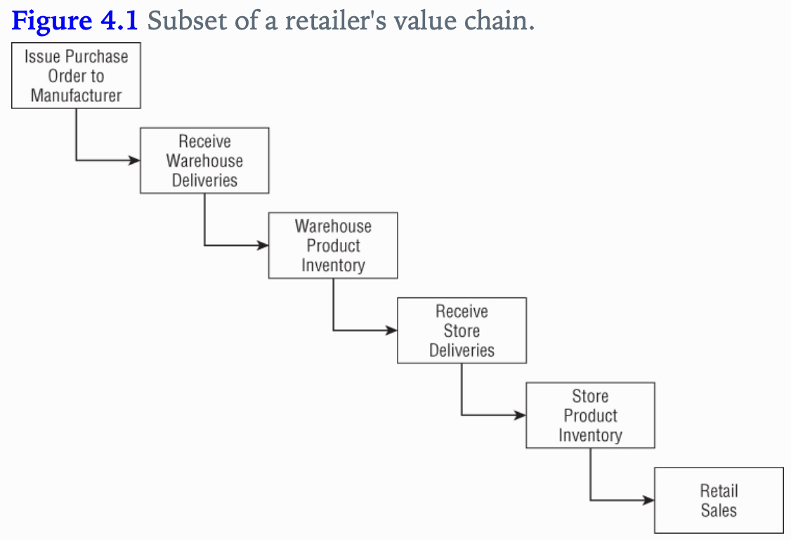

## Inventory
- We remain the same industry as retail, but we move up the value chain to tackle the inventory process.
- This chapter will provide a thorough discussion of the enterprise data warehouse bus architecture.
- Underscore the importance of using conformed dimensions and facts

Concepts to discuss
1. represent org value chains via series of dim models
2. semi-additive facts
3. Three fact table types
	1. periodic snapshots
	2. transactions
	3. accumulating snapshots
4. Enterprise DWH bus architecture and matrix
5. Opportunity / stakeholder matrix
6. Conformed dims and facts
7. Data governance

### Value Chain Intro
The value chain illustrated:

### Inventory Models
Several inventory models to discuss:
- Inventory periodic snapshot - product inventory levels are measured at regular intervals and placed as separate regular intervals and placed as separate rows in a fact table.
- Transaction - every transaction is recorded
- Inventory accumulating snapshot: fact table row is inserted for each product delivery

#### Inventory Periodic Snapshot
Optimizing inventory levels at the store has a major impact on profitability.
Let's start with the 4 step dim design process:
1. Business process: analyzing periodic snapshotting of  retail store inventory.
2. Grain: the most atomic level of detail provided is a daily inventory for each product in each store.
3. Dimensions: date,product, store
4. Fact: quantity on hand

- The date dimension is identical to the table from Retail.
- The product dimension could be enhanced with columns such as minimum reorder quantity
- Even a sparse fact table such as in figure 4.2 is useful. One challenge faced in this fact table is that inventory need to contain a row for every product that doesn't exist, as well as inventory that does exist. This can lead to 

